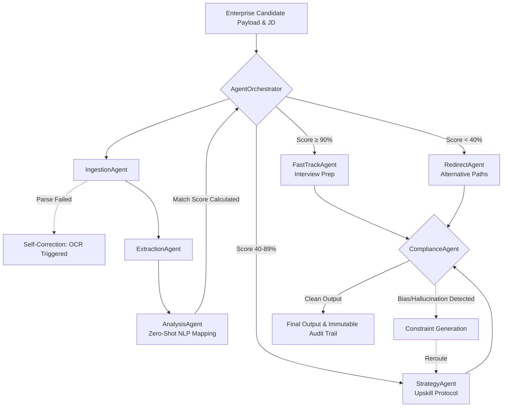

# SkillBridge-AI: Enterprise Agentic Workflow Orchestrator

## 1. Executive Summary

### The Challenge
**ET Gen AI Hackathon Problem Statement 2:**
> "Design a multi-agent system that takes ownership of a complex, multi-step enterprise process. It should detect failures, self-correct, and complete the job with minimal human involvement — while keeping an auditable trail of every decision it makes."

### The Solution: SkillBridge-AI
**SkillBridge-AI** completely owns and executes the complex, high-friction enterprise workflow of Technical Candidate Screening and Skill-Gap Analysis. 

**The Final Goal:** Replace a slow, manual 45-minute HR screening task with a deterministic, self-correcting 3-second autonomous workflow. The system is designed to respect data privacy (100% offline-native, meaning no PII ever leaves the corporate firewall) while generating an immutable audit log mapping every programmatic decision made by the agents.

---

## 2. Multi-Agent Architecture & Agent Roles

Unlike a simple linear pipeline, SkillBridge-AI operates as an **Intelligent Decision Graph**. The system evaluates real-time data at every node and conditionally delegates execution to the appropriate specialized sub-agent.



### Agent Roles & Responsibilities
- **`AgentOrchestrator`**: The manager. It maintains the global state, monitors millisecond SLA budgets, and delegates execution. It is the only entity permitted to decide *which* agent runs next.
- **`IngestionAgent`**: The Data Miner. Responsible for resolving arbitrary PDF layouts into clean string payloads.
- **`ExtractionAgent`**: The NLP Specialist. Parses string payloads into semantic clusters, rejecting noisy structural nouns (like 'phone number' or 'references').
- **`AnalysisAgent`**: The Data Scientist. Executes a proprietary 7-Pass AI classifier using FAISS vector clustering. It calculates candidate overlap and scores missing deficits.
- **Generative Execute Agents (`StrategyAgent`, `FastTrackAgent`, `RedirectAgent`)**: Context-aware advisors. Depending on the Orchestrator's score threshold decisions, one of these agents is activated to draft an actionable blueprint (ranging from an interview prep sheet to a multi-month redirection plan).
- **`ComplianceAgent`**: The Validator. Analyzes upstream generative agent outputs to detect structural hallucinations, bias, and inappropriate tone.

### Agent Communication Protocol
Agents communicate via a strictly typed, memory-safe data carrier called `WorkflowState`. 
* **Stateless Agents:** Individual agents (e.g., the ExtractionAgent) do not hold session memory. They request specific payload data from the Orchestrator.
* **Handshake Protocol:** When an agent finishes execution, it returns a standard `{'success': bool, 'data': {...}, 'message': str}` dictionary. 
* **Ledger Synchronization:** The Orchestrator intercepts this handshake, updates the `WorkflowState`, and permanently logs the transaction (including execution time and confidence score) into the `AuditLogger` before assigning the state to the next agent in the graph.

### Tool Integrations
Agents are empowered by localized, air-gapped system tool APIs rather than external internet calls:
1. **Llama 3.2 (via Ollama)**: The generative cognitive engine driving the execution and compliance agents.
2. **FAISS (CPU-Optimized)**: The sub-millisecond vector database allowing the AnalysisAgent to calculate cross-implications of missing skills.
3. **spaCy (`en_core_web_sm`)**: The NLP engine utilized by the ExtractionAgent for Named Entity Recognition (NER) and parts-of-speech dependency tagging.
4. **SentenceTransformers (`all-MiniLM-L6-v2`)**: Integrated deeply into the AnalysisAgent to generate embeddings for semantic similarity.
5. **pdfplumber / Tesseract OCR**: Bound to the IngestionAgent for complex document digestion.

---

## 3. Fulfilling the Judging Criteria

> [!IMPORTANT]
> How SkillBridge-AI maps directly to the four core elements of the ET Gen AI Hackathon Rubric.

### A. Depth of Autonomy
The system achieves 100% autonomous completion without human involvement (unless explicitly escalated). 
* **Zero-Shot NLP Extraction**: The Orchestrator does *not* utilize hardcoded lists of "skills to look for." It dynamically understands whether a word functions as an actionable technical ability in standard English syntax.
* **Intelligent Routing**: Based on the `AnalysisAgent`'s calculated vector-match score, the Orchestrator autonomously decides how to treat the candidate. *High-scoring candidates are instantly routed to the FastTrackAgent to auto-generate interview questions; low-scoring candidates trigger the RedirectAgent to map their vectors to alternative enterprise roles.*

### B. Quality of Error Recovery (Self-Correction Logic)
SkillBridge-AI fundamentally distrusts basic execution paths and utilizes multi-stage self-correction loops to eliminate brittle failures:
* **The Ingestion/Extraction Loop (Scrape Failure Recovery):** If the IngestionAgent rapidly processes a PDF but the ExtractionAgent subsequently returns an error dictionary showing `0 viable skills` extracted, the Orchestrator flags a scrape failure. It immediately rewinds the execution graph, activates the IngestionAgent's `use_ocr=True` fallback tool, and restarts the pipeline seamlessly.
* **The Strategy/Compliance Loop (Hallucination Recovery):** If a candidate's profile is complex, the StrategyAgent might hallucinate or exhibit bias. The ComplianceAgent scans the output array. If a violation is caught, it returns `success: False` with a list of specific violation texts. The Orchestrator catches this failure, builds a new constraint prompt from the violations, and routes execution *back* to the StrategyAgent forcing a regeneration (up to the SLA limit of 2 retries). 

### C. Auditability
* **Immutable Audit Ledger**: The core requirement for enterprise deployment. The `AuditLogger` acts as the backbone of the entire workflow.
* Every single processing step logs:
  1. The specific agent running.
  2. Sub-millisecond execution duration (vital for tracking SLA budgets).
  3. Routing decisions with **reasoning** and **confidence scores**.
  4. Alternatives considered at the node.
* Complete visual transparency is surfaced on the UI Dashboard and exportable via JSON for HR compliance.

### D. Real-World Applicability
Enterprise IT organizations fundamentally cannot pass unfiltered candidate PII (names, phone numbers, addresses) or proprietary job architectures to consumer LLMs like ChatGPT or Claude.
* **100% Offline-Native Architecture**: SkillBridge-AI relies entirely on local compute.
* Zero APIs. Zero external network requests. Utterly air-gapped.

---

## 4. Technical Stack

| Domain | Technology Layer |
| :--- | :--- |
| **User Interface** | Streamlit (Python 3.10+) |
| **Agent Orchestration** | Custom Python State-Machine & Routing Logic |
| **Vector Database** | Meta FAISS (CPU-Optimized) |
| **NLP & Extraction** | `en_core_web_sm` (spaCy), Regex Pattern Filtering |
| **Embedding Models** | all-MiniLM-L6-v2 (`sentence-transformers`) |
| **Generative LLM (Local)**| Ollama (Llama 3.2 1b/3b) |

---

## 5. Running the Orchestrator

**Prerequisites:** Python 3.10+, Ollama.

```bash
# Start your local Llama instance
ollama pull llama3.2
ollama serve

# Install the dependencies
pip install -r requirements.txt
python -m spacy download en_core_web_sm

# Launch the Enterprise Orchestrator Dashboard
streamlit run app.py
```
